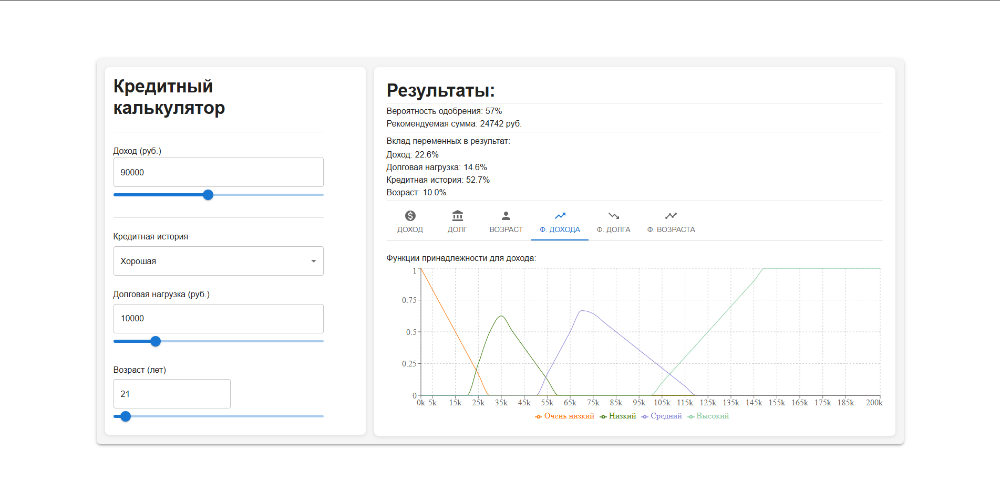

# Отчет по проекту: Кредитный калькулятор на основе нечеткой логики

Кредитный калькулятор — это веб-приложение, разработанное для оценки вероятности одобрения кредита и рекомендуемой суммы на основе нечёткой логики. Пользователь вводит данные (доход, долговая нагрузка, кредитная история, возраст), а приложение отображает результаты в виде числовых показателей и интерактивных графиков.

## 1. Введение
Система помогает оценить кредитоспособность клиента, используя нечеткую логику для обработки неоднозначных данных, что делает её гибкой и реалистичной.

## 2. Постановка задачи
Создать веб-приложение, где пользователь вводит данные (доход, кредитная история и т.д.), а система выдает вероятность одобрения и сумму кредита.

## 3. Цели
- Реализовать интерактивный интерфейс.
- Обеспечить точные расчеты с помощью нечеткой логики.
- Визуализировать результаты.

## 4. Входные переменные и термы
- Доход (0–200,000 руб.)
- Долговая нагрузка (0–50,000 руб.)
- Кредитная история (плохая, средняя, хорошая)
- Возраст (18–70 лет)

## 5. Результаты
Графики показывают зависимость вероятности одобрения от входных данных (будут добавлены после реализации).

## 6. Заключение
Система эффективно решает задачу, а использование нечеткой логики подтверждает теорему Кастро о возможности аппроксимации сложных функций.


## Основные функции
- **Ввод данных**:
  - Доход (0–200,000 руб.)
  - Долговая нагрузка (0–50,000 руб.)
  - Кредитная история (плохая, средняя, хорошая)
  - Возраст (18–70 лет)
- **Вывод результатов**:
  - Вероятность одобрения кредита (%)
  - Рекомендуемая сумма кредита (руб.)
  - Вклад каждой переменной в результат (%)
- **Интерактивные графики**:
  - Зависимость вероятности от дохода, долговой нагрузки и возраста
  - Функции принадлежности для входных переменных
- **Адаптивный дизайн**: Поддержка мобильных и десктопных устройств
- **Анимации**: Плавное переключение графиков с помощью Material-UI

## Технологии
- **Frontend**: React, TypeScript, Material-UI, Recharts
- **Состояние**: Redux Toolkit
- **Логика**: Нечёткая логика (fuzzy logic) для расчётов
- **Тестирование**: Jest (для логики)
- **Стили**: Material-UI Theme, sx-пропсы

## Основная структура проекта
```
├── client/
│   ├── src/
│   │   ├── App.tsx                 # Главный компонент
│   │   ├── components/             # React-компоненты
│   │   │   ├── CreditForm.tsx      # Форма ввода данных
│   │   │   ├── CreditResult.tsx    # Отображение результатов и графиков
│   │   ├── fuzzyLogic/             # Логика нечётких вычислений
│   │   │   ├── fuzzyRules.ts       # Все правила
│   │   │   ├── fuzzySystem.test.ts # Тесты
│   │   │   ├── fuzzySystem.ts      # Основная логика
│   │   ├── index.css
│   │   ├── main.tsx                # Точка входа
│   │   ├── services/
│   │   ├── store/                  # Redux store
│   │   │   ├── index.ts            # Конфигурация store
│   │   │   ├── slices/             # Слайсы Redux
│   │   │   │   ├── creditSlice.ts
│   │   ├── theme.ts                # Глобальная тема Material-UI
│   │   ├── types/                  
│   │   │   ├── index.ts            # Интерфейсы
│   ├── tsconfig.app.json
│   ├── tsconfig.json
│   ├── tsconfig.node.json
│   ├── vite.config.ts
│   ├── .eslintrc.json
│   ├── .gitignore
│   ├── .prettierrc
│   ├── eslint.config.js
│   ├── index.html
│   ├── jest.config.cjs
│   ├── package-lock.json
│   ├── package.json                # Зависимости и скрипты
│   ├── README.md 
├── README.md                       # Документация

```

## Установка
1. **Клонируйте репозиторий**:
   ```bash
   git clone <repository-url>
   cd credit-calculator
   ```
2. **Установите зависимости**:
   ```bash
   npm install
   ```
   Требуется Node.js версии 16 или выше.

## Запуск
1. **Запустите приложение в режиме разработки**:
   ```bash
   npm run dev
   ```
   Приложение будет доступно по адресу `http://localhost:5173`.
2. **Сборка для продакшена**:
   ```bash
   npm run build
   ```
   Статические файлы будут в папке `dist`.

## Тестирование
1. **Запустите тесты**:
   ```bash
   npm run test
   ```
   Тесты проверяют логику нечётких вычислений (`fuzzySystem.test.ts`).
2. **Добавление UI-тестов**:
   Для тестирования компонентов установите `@testing-library/react`:
   ```bash
   npm install --save-dev @testing-library/react @testing-library/jest-dom
   ```
   Пример теста:
   ```typescript
   import { render, screen } from '@testing-library/react';
   import { Provider } from 'react-redux';
   import store from './store';
   import CreditForm from './components/CreditForm';

   test('renders credit form', () => {
     render(
       <Provider store={store}>
         <CreditForm />
       </Provider>
     );
     expect(screen.getByLabelText(/Доход/i)).toBeInTheDocument();
   });
   ```

## Использование
1. **Ввод данных**:
   - Заполните поля формы (`CreditForm`):
     - Доход: Введите число или используйте слайдер.
     - Долговая нагрузка: Укажите текущие долги.
     - Кредитная история: Выберите из выпадающего списка.
     - Возраст: Введите число или используйте слайдер.
   - Данные автоматически отправляются для расчёта.
2. **Просмотр результатов**:
   - В `CreditResult` отобразятся:
     - Вероятность одобрения и сумма кредита.
     - Вклад переменных (в процентах).
     - Графики (переключаются через вкладки).
3. **Переключение графиков**:
   - Используйте вкладки с иконками для просмотра зависимостей или функций принадлежности.

## Best Practices
- **Модульность**:
  - Компоненты (`CreditForm`, `CreditResult`) независимы и переиспользуемы.
  - Глобальная тема (`theme.ts`) обеспечивает единообразие стилей.
- **Адаптивность**:
  - Используется `flex` с breakpoints (`xs`, `md`) для мобильных и десктопных устройств.
  - `Container` с `maxWidth="xl"` ограничивает ширину.
- **Доступность**:
  - ARIA-атрибуты (`aria-label`, `aria-labelledby`) для экранных читалок.
  - Подписи (`Typography`) связаны с полями ввода.
- **Чистый код**:
  - TypeScript для строгой типизации.
  - Комментарии для сложных блоков.
  - Логика вычислений вынесена в `fuzzyLogic`.

## Известные ограничения
- Автоматический расчёт при изменении данных (нет кнопки "Рассчитать").
- Отсутствуют UI-тесты для компонентов (рекомендуется добавить).
- Нет поддержки тёмной темы.

## Планы по улучшению
1. Реализовать переключение светлой/тёмной темы.
2. Написать UI-тесты с `@testing-library/react`.
3. Настроить Docker для контейнеризации.
4. Добавить локализацию (например, английский язык).

## Скриншот


---
Создано с использованием React, TypeScript, Material-UI и нечёткой логики.