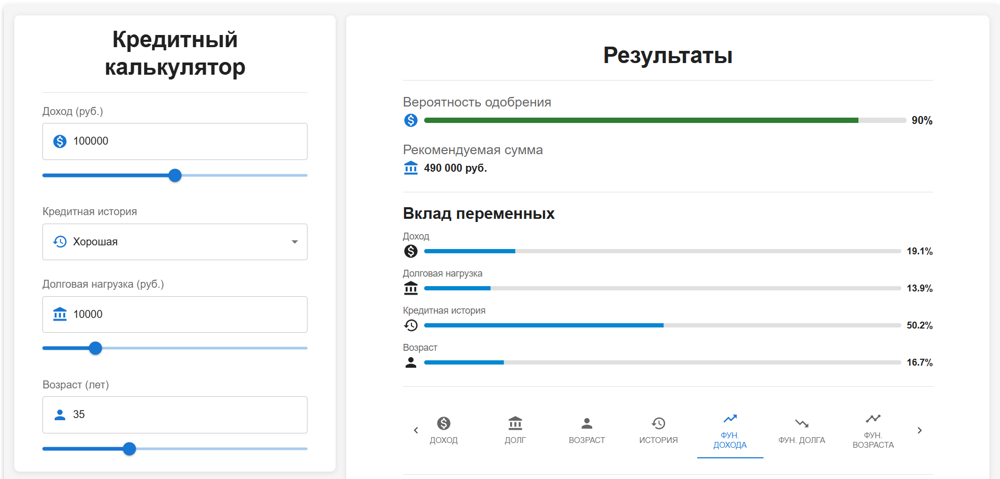
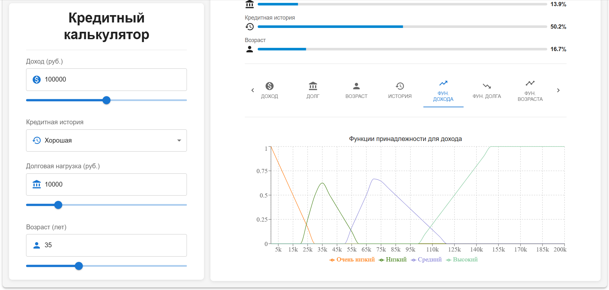

# Кредитный калькулятор на основе нечёткой логики

Кредитный калькулятор — это веб-приложение для оценки вероятности одобрения кредита и рекомендуемой суммы с использованием нечёткой логики. Пользователь вводит данные (доход, долговая нагрузка, кредитная история, возраст) через интуитивный интерфейс с иконками, слайдерами и всплывающими подсказками. Результаты отображаются в виде числовых показателей, прогресс-баров и интерактивных графиков, включая зависимости вероятности от входных переменных и функции принадлежности.

## Основные возможности

- **Ввод данных**:
  - Доход: 0–200,000 руб. (число или слайдер).
  - Долговая нагрузка: 0–50,000 руб. (число или слайдер).
  - Кредитная история: Плохая, Средняя, Хорошая (выпадающий список).
  - Возраст: 18–70 лет (число или слайдер).
- **Вывод результатов**:
  - Вероятность одобрения: 0–100%.
  - Рекомендуемая сумма: 0–1,000,000 руб. (округлена до 10,000 руб.).
  - Вклад переменных: Процентное влияние дохода, долга, истории и возраста.
- **Интерактивные графики** (реализованы с Recharts):
  - Зависимость вероятности от дохода, долговой нагрузки, возраста и кредитной истории.
  - Функции принадлежности для дохода, долга, возраста и вероятности.
- **Адаптивный интерфейс**:
  - Фиксированная форма ввода на десктопе (`position: sticky`).
  - Поддержка мобильных и десктопных устройств (breakpoints `xs`, `md`).
- **Анимации и доступность**:
  - Плавное переключение графиков (Material-UI).
  - ARIA-атрибуты для экранных читалок.

## Пример использования

**Входные данные**:
- Доход: 100,000 руб.
- Долговая нагрузка: 10,000 руб.
- Кредитная история: Хорошая.
- Возраст: 35 лет.

**Результат**:
- Вероятность одобрения: 90%.
- Рекомендуемая сумма: 490,000 руб.
- Вклад: Доход (19.1%), Долг (13.9%), История (50.2%), Возраст (16.7%).

**Расчёт суммы**:
\[
\text{Сумма} = \text{Доход} \cdot \frac{\text{Вероятность}}{100} \cdot k \cdot f_{\text{долг}} \cdot f_{\text{возраст}} \cdot f_{\text{история}}
\]
Где:
- \( k = 6 \) (вероятность ≥ 80%), 5 (≥ 50%), иначе 3.
- \( f_{\text{долг}} = 1 - \frac{\text{Долг}}{\text{Доход}} = 1 - \frac{10,000}{100,000} = 0.9 \).
- \( f_{\text{возраст}} = 1 \) (возраст 35), 0.8 (< 30), 0.7 (> 60).
- \( f_{\text{история}} = 1 \) (хорошая), 0.8 (средняя), 0.5 (плохая).

Пример: \( 100,000 \cdot \frac{90}{100} \cdot 6 \cdot 0.9 \cdot 1 \cdot 1 = 486,000 \approx 490,000 \) руб.

## Технологии

- **Frontend**: React, TypeScript, Material-UI, Recharts.
- **Состояние**: Redux Toolkit.
- **Логика**: Нечёткая логика (алгоритм Мамдани, 192 правила, дефаззификация методом центроида).
- **Тестирование**: Jest (для логики в `fuzzySystem.test.ts`).
- **Стили**: Material-UI Theme, `sx`-пропсы.

## Структура проекта

```
├── client/
│   ├── src/
│   │   ├── App.tsx                 # Главный компонент
│   │   ├── components/             # React-компоненты
│   │   │   ├── CreditForm.tsx      # Форма ввода
│   │   │   ├── CreditResult.tsx    # Результаты и графики
│   │   ├── fuzzyLogic/             # Нечёткая логика
│   │   │   ├── fuzzyRules.ts       # Правила (192 комбинации)
│   │   │   ├── fuzzySystem.test.ts # Тесты логики
│   │   │   ├── fuzzySystem.ts      # Расчёты
│   │   ├── store/                  # Redux store
│   │   │   ├── index.ts            # Конфигурация store
│   │   │   ├── slices/             # Слайсы
│   │   │   │   ├── creditSlice.ts  # Состояние формы
│   │   ├── theme.ts                # Тема Material-UI
│   │   ├── types/                  # TypeScript-интерфейсы
│   │   ├── index.css
│   │   ├── main.tsx                # Точка входа
│   ├── tsconfig.app.json
│   ├── tsconfig.json
│   ├── tsconfig.node.json
│   ├── vite.config.ts
│   ├── .eslintrc.json
│   ├── .gitignore
│   ├── .prettierrc
│   ├── eslint.config.js
│   ├── index.html
│   ├── jest.config.cjs
│   ├── package-lock.json
│   ├── package.json
│   ├── README.md
├── screenshots/                    # Скриншоты для отчёта
├── report.tex                      # LaTeX-отчёт
├── README.md                       # Документация
```

## Установка

1. **Клонируйте репозиторий**:
   ```bash
   git clone <repository-url>
   cd credit-calculator
   ```

2. **Установите зависимости**:
   ```bash
   npm install
   ```
   Требуется Node.js версии 16 или выше.

## Запуск

1. **Запустите в режиме разработки**:
   ```bash
   npm run dev
   ```
   Приложение доступно по адресу `http://localhost:5173`.

2. **Сборка для продакшена**:
   ```bash
   npm run build
   ```
   Файлы будут в папке `dist`.

## Тестирование

1. **Запустите тесты**:
   ```bash
   npm run test
   ```
   Тесты проверяют логику в `fuzzySystem.test.ts`.

2. **Добавление UI-тестов**:
   Установите зависимости:
   ```bash
   npm install --save-dev @testing-library/react @testing-library/jest-dom
   ```
   Пример теста для `CreditForm`:
   ```typescript
   import { render, screen } from '@testing-library/react';
   import { Provider } from 'react-redux';
   import store from './store';
   import CreditForm from './components/CreditForm';

   test('renders credit form', () => {
     render(
       <Provider store={store}>
         <CreditForm />
       </Provider>
     );
     expect(screen.getByLabelText(/Доход/i)).toBeInTheDocument();
   });
   ```

## Использование

1. **Ввод данных**:
   - В форме (`CreditForm.tsx`) заполните поля:
     - Доход и долг: Числа или слайдеры.
     - Кредитная история: Выберите из списка.
     - Возраст: Число или слайдер.
   - Расчёт выполняется автоматически при изменении данных.

2. **Просмотр результатов**:
   - В `CreditResult.tsx` отображаются:
     - Вероятность и сумма кредита.
     - Вклад переменных (прогресс-бары).
     - Графики (переключение через вкладки).

3. **Работа с графиками**:
   - Переключайте вкладки для просмотра зависимостей или функций принадлежности.
   - График для кредитной истории показывает зависимость вероятности, так как она категориальная.

## Нечёткая логика

- **Фаззификация**: Входные данные преобразуются в степени принадлежности (трапецеидальные функции для дохода, долга, возраста; дискретные для кредитной истории).
- **Правила**: 192 лингвистических правила (`fuzzyRules.ts`), сгенерированных комбинацией термов:
  - Доход: Очень низкий, Низкий, Средний, Высокий.
  - Долг: Очень низкая, Низкая, Средняя, Высокая.
  - История: Плохая, Средняя, Хорошая.
  - Возраст: Очень низкий, Низкий, Средний, Высокий.
  - Выход: Низкая, Средняя, Высокая (вероятность).
- **Баллы и веса**:
  - Доход: 0–3; Долг: 3–0 (обратная шкала); История: 0–2; Возраст: 0–2.
  - Сумма баллов (макс. 10) определяет выход и вес (например, ≥7 → Высокая, вес 0.9).
- **Дефаззификация**: Метод центроида, центры: 20% (Низкая), 50% (Средняя), 90% (Высокая).

## Best Practices

- **Модульность**: Компоненты (`CreditForm`, `CreditResult`) и логика (`fuzzySystem`) независимы.
- **Адаптивность**: Flex-раскладка, breakpoints (`xs`, `md`), `maxWidth="xl"`.
- **Доступность**: ARIA-атрибуты, связанные подписи (`Typography`).
- **Чистый код**: TypeScript, комментарии, вынос логики в `fuzzyLogic`.

## Ограничения

- Нет кнопки «Рассчитать» (расчёт автоматический).
- Отсутствуют UI-тесты для компонентов.
- Нет поддержки тёмной темы или локализации.

## Планы по улучшению

- Добавить 3D-графики с Plotly.js (например, доход vs долг).
- Реализовать кнопку «Очистить форму» в `CreditForm.tsx`.
- Написать UI-тесты с `@testing-library/react`.
- Настроить Docker для контейнеризации.
- Добавить переключение светлой/тёмной темы.
- Поддержка локализации (например, английский язык).

## Скриншоты




## Документация

Полное описание проекта, включая математическое обоснование и анализ, доступно в отчёте: [report.pdf](report.pdf).

---
Создано с использованием React, TypeScript, Material-UI и нечёткой логики. 